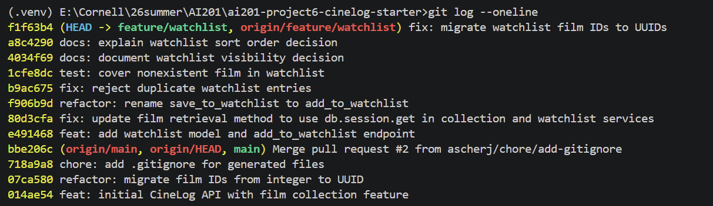

# PR Response Doc — CineLog Watchlist Feature

## AI Usage
- File summary: summuarize the main function, dependency of models.py, services/collection_service.py, and tests/test_collection.py.
e.g.  "[models.py](models.py) Summarize what this file is responsible for, what its main functions do, and what other parts of the codebase it depends on"
- Function explanation: "What does this function do? Walk me through what happens at each step, and what it returns if the film_id doesn't exist." Use this on add_to_collection() (cpmment2)
- Test structure: Give the AI the test_collection.py file and ask: "What pattern does each test follow? What do I need to provide to write a test in the same style?" (comment4)
- Reasoning stress test: I asked AI to act as a careful reviewer of my
  `public=True` position and identify counterarguments or tradeoffs I had
  missed. I used the critique to reconsider the position, then wrote the final
  CineLog-specific reasoning below in my own words. (comment4)
  After drafting my Comment 5 response, I asked AI
  to act as a careful reviewer and identify counterarguments and missing
  tradeoffs in the newest-first decision. I used the critique to address
  alphabetical lookup and the lack of user research, then finalized the
  reasoning in my own words.(comment5)

## git log --oneline screenshot


## Comment 1 — Rename

save_to_watchlist() should follow the project's naming convention. Compare with add_to_collection() — the pattern here is verb_to_noun. Please rename to add_to_watchlist() and update all call sites.

**What I did:**
Use ctrl+shift+f found all `save_to_watchlist` in 3 places, in 2 files: `services/watchlist_service.py` for defination, `routes/watchlist/watchlist.py` for import function and call function.
Renamed `save_to_watchlist()` to `add_to_watchlist()` to follow the project's `verb_to_noun` naming convention. I also updated the import and route call site to use the new function name.

**How I verified:**
Searched the repository to confirm that no references to `save_to_watchlist` remained. I also ran `pytest -q` and confirmed that all tests passed.


## Comment 2 — Deduplication

What happens if a user calls this with a film that's already on their watchlist? The current implementation would add a duplicate entry. Please handle this case.

**What I did:**
1. read `add_to_collection() in services/collection_service.py` carefully.
2. define a new class: `AlreadyInWatchlistError` and revise the `add_to_watchlist()`'s docstring
3. Added an `AlreadyInWatchlistError` and updated `add_to_watchlist()` to check for an existing `WatchlistEntry` with the same `user_id` and `film_id` before creating a new entry. Duplicate requests are rejected instead of creating another database record. I also updated the watchlist route to return HTTP 409 for this conflict.

**How I verified:**
Added the same film to the same user's watchlist twice and confirmed that the second request was rejected while only one matching `WatchlistEntry` remained in the database. I also ran `pytest -q` and confirmed that all 4 existing tests passed.

## Comment 3 — Missing test

Please add a test for the case where film_id doesn't exist in the database. Look at the existing tests in test_collection.py — the pattern is there.

**What I did:**
1. read `tests\test_collection.py` carefully, and learnt form it
2. Added `tests/test_watchlist.py` with a test confirming that
`add_to_watchlist()` raises `FilmNotFoundError` when given a film ID
that does not exist. 

**How I verified:**
Ran `pytest tests/test_watchlist.py -v` and confirmed that the test passed.

## Comment 4 — Default visibility

I notice watchlists default to public=True. We don't have a documented decision on default visibility for user lists. Before I can approve this, I need you to add a note to your PR description explaining your reasoning. I want to make sure we're being intentional here, not just inheriting a default.

**My position:**
After stress-testing the original `public=True` rationale, I would change the
default to `public=False` and let users explicitly make a watchlist public.

**Reasoning:**
I am optimizing for users to save films freely without first deciding whether
each choice should be visible to the CineLog community. A watchlist records
future viewing intentions and can reveal interests a user has not chosen to
review, rate, or discuss publicly. CineLog's community focus makes sharing
valuable, but it does not establish that every saved list is social by default.
A clear public label would improve transparency, but many users keep defaults;
the safer default should therefore protect the user who never visits the
visibility setting. An explicit "Make public" action still supports CineLog's
discovery and discussion goals while making publication an intentional choice.

**Tradeoff acknowledged:**
The maintainer could reasonably argue that `public=False` weakens a community
film platform: fewer visible watchlists mean fewer opportunities to discover
films through other users, and users who would be comfortable sharing may
never change the default. That cost is real. However, the two mistakes have
different consequences. A private list can be shared later, while an
unintentionally public list may already have exposed information and damaged
the user's trust. Without evidence that CineLog users expect watchlists to be
public, I would accept the extra sharing friction and choose the reversible,
privacy-preserving default.

## Comment 5 — Sort order

I'd prefer watchlists to default to "date added" order rather than alphabetical. Most users want to see what they added recently. I'm open to discussion if you see it differently — but let's make a decision and document it.

**My position:** I agree with the maintainer and will use date added, newest first, as the default watchlist order.

**Reasoning:**
A watchlist primarily helps CineLog users return to films they saved for
later. Recently added films are more likely to reflect a user's current
viewing interests, so showing them first makes it easier to answer, “What
did I recently save to watch?” This also matches CineLog's existing
collection behavior, which already returns newer entries first. I changed
`get_watchlist()` to order by `WatchlistEntry.date_added` descending and
added a test that verifies the newer entry is returned first. Writing that
test also surfaced a pre-existing bug: `Film` had no relationship back to
`WatchlistEntry`, so `entry.film.to_dict()` in `get_watchlist()` raised an
`AttributeError` any time the function was actually called — it had no test
coverage before this PR. I added the missing `watchlist_entries` relationship
on `Film` (mirroring the existing `collection_entries` relationship) to fix
it.

**Engagement with reviewer's point:**
I agree with the maintainer that recent additions are the more useful
default for most watchlist visits. Alphabetical sorting still has an
advantage when a user knows the title and wants to locate it in a long
list, so it would be a useful optional sort mode in the future. However,
for a single default, newest-first better supports the common behavior of
returning to films that were just saved. This decision is based on the
current product behavior rather than user research, so it should be
revisited if CineLog later collects evidence that users prefer another
order.

## Comment 6 — Rebase

A refactor merged to main that changed film IDs from integers to UUIDs. Your watchlist code still references integer IDs. Please rebase on main and update accordingly.

**What conflicted:**

The rebase produced an add/add conflict in `.gitignore` because both the
feature branch and `main` had added that file independently. There was also a
semantic conflict that Git did not mark with conflict markers: the UUID
refactor on `main` removed the legacy `WatchlistEntry`, while the watchlist
service still imported and used that model. The remaining watchlist
documentation also described `film_id` as an integer even though `Film.id` is
now a UUID string.

**How I resolved it:**

I kept the combined `.gitignore` rules, including `main`'s generated-file
entries such as `.pytest_cache/`, staged the resolved file, and continued the
rebase with `git rebase --continue`. After all feature commits had been
replayed on `origin/main`, I restored `WatchlistEntry` using the post-refactor
schema: its `film_id` foreign key uses `db.String(36)` so it matches
`Film.id`. I also updated the watchlist service parameter documentation and
the route request-body example to describe `film_id` as a UUID string rather
than an integer.

**How I verified no conflict remains:**

I searched the watchlist model, service, route, and tests for remaining
integer-ID references and confirmed that watchlist film IDs consistently use
UUID strings. I ran `pytest tests/test_watchlist.py -v` followed by `pytest
-q` to check the focused behavior and the full test suite. Finally, I ran
`git log --oneline --merges origin/main..HEAD` and confirmed that it produced
no output, which shows that the feature branch adds no merge commits after
the rebase. I also used `git merge-base --is-ancestor origin/main HEAD` and
confirmed a zero exit status, showing that the updated `origin/main` is an
ancestor of the rebased branch.

## PR Description

### What this PR does

This PR adds a **watchlist** feature to CineLog, letting a user save films
they intend to watch later, separate from their existing film collection.

- `POST /watchlist/<user_id>/add` — add a film to a user's watchlist, given
  `{ "film_id": "<uuid>" }` in the request body. Returns `201` with the new
  entry, `404` if the film does not exist, and `409` if the film is already
  on that user's watchlist.
- `GET /watchlist/<user_id>` — return all films on a user's watchlist, each
  annotated with `date_added` and `public`.
- A new `WatchlistEntry` model tracks `user_id`, `film_id`, `date_added`, and
  a `public` flag, with `film_id` stored as a UUID string to match the
  post-refactor `Film.id` on `main`.
- Duplicate adds are rejected with `AlreadyInWatchlistError` instead of
  creating a second row for the same `(user_id, film_id)` pair.

### Design decisions

- **Default visibility:** `WatchlistEntry.public` defaults to `False`. A
  saved-for-later list can reveal interests a user hasn't chosen to make
  public, and a private default is the reversible choice for users who never
  visit the visibility setting. See Comment 4 above for the full reasoning.
- **Sort order:** `get_watchlist()` returns entries ordered by
  `WatchlistEntry.date_added` descending (newest first), matching the
  existing `get_collection()` behavior and answering "what did I recently
  save?" See Comment 5 above for the full reasoning.

### How to test manually

1. Start the app: `flask run` (or however this project normally starts).
2. Create a user and a film if you don't already have their UUIDs (via the
   existing `/users` and `/films` endpoints, or by inspecting the seeded
   test data).
3. Add a film to the watchlist:
   ```bash
   curl -X POST http://localhost:5000/watchlist/<user_id>/add \
     -H "Content-Type: application/json" \
     -d '{"film_id": "<film_id>"}'
   ```
   Expect `201` and the new entry back in the response body.
4. Repeat the same request. Expect `409` and an error message — the entry
   should not be duplicated.
5. Try adding a film with a made-up UUID as `film_id`. Expect `404`.
6. Add a second film, then view the watchlist:
   ```bash
   curl http://localhost:5000/watchlist/<user_id>
   ```
   Expect both films back, each with `public: false` by default, and the
   **second film listed first** (newest added first).
7. Run the automated tests: `pytest tests/test_watchlist.py -v` and
   `pytest -q` for the full suite.
